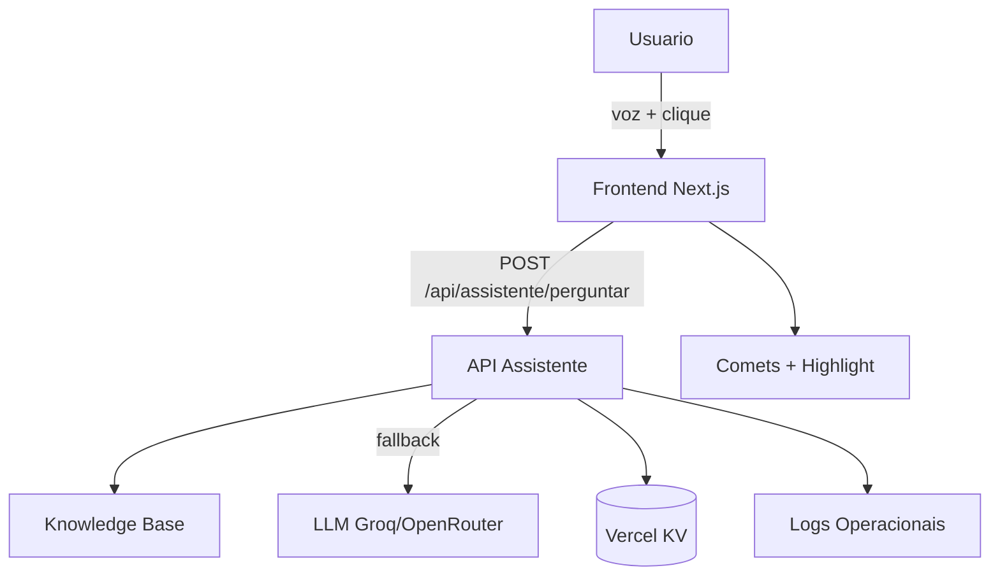
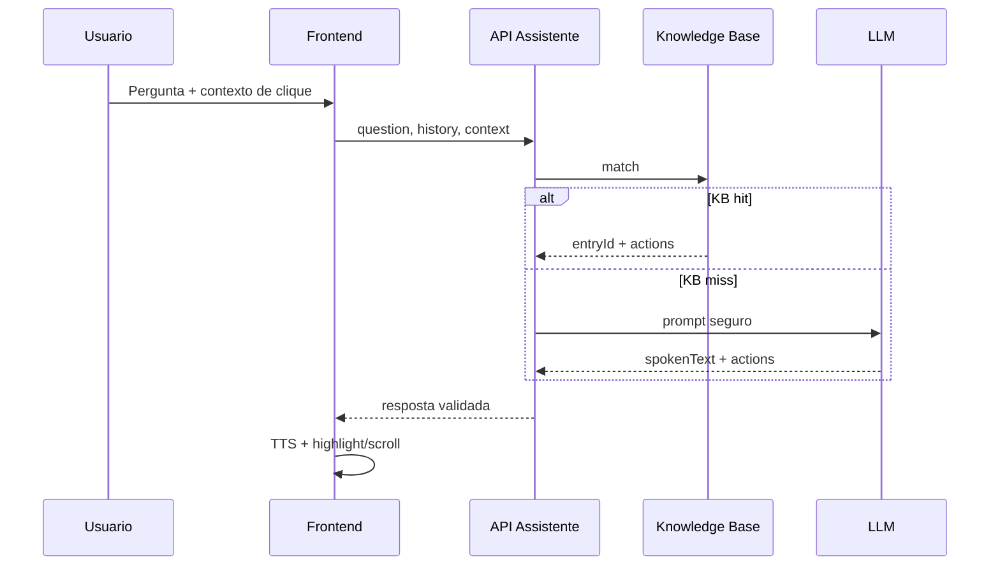

# Arquitetura do Sistema

## Resumo
A arquitetura e organizada em tres camadas principais:
1. **Frontend (Next.js)**: interface publica, assistente ao vivo, com destaque visual e navegação guiada.
2. **API (Route Handlers)**: aplica regras de segurança, consulta KB, aciona LLM quando necessario e valida actions.
3. **Infra local/KV**: cache, rate limit, circuit breaker e logs operacionais.

## Componentes principais
- **Assistente Live (UI)**: captura voz (STT), fala (TTS), entende contexto do clique e executa actions.
- **Base de Conhecimento (KB)**: respostas rápidas para perguntas comuns e ações de navegação.
- **API /api/assistente/perguntar**: valida entrada, aplica limites e retorna spokenText + actions.
- **Comets/Highlights**: camada visual para guiar o usuario (scroll, highlight, navegação).
- **API /api/metrics**: coleta Web Vitals para observabilidade.

## Diagrama de alto nivel

## Fluxo de resposta

## Pontos criticos
- **Validador de actions**: bloqueia selectors livres e garante allowlist de IDs/rotas.
- **Rate limit + circuit breaker**: previnem abuso e falhas repetidas.
- **Cache**: evita recomputar respostas em sequencias curtas.
