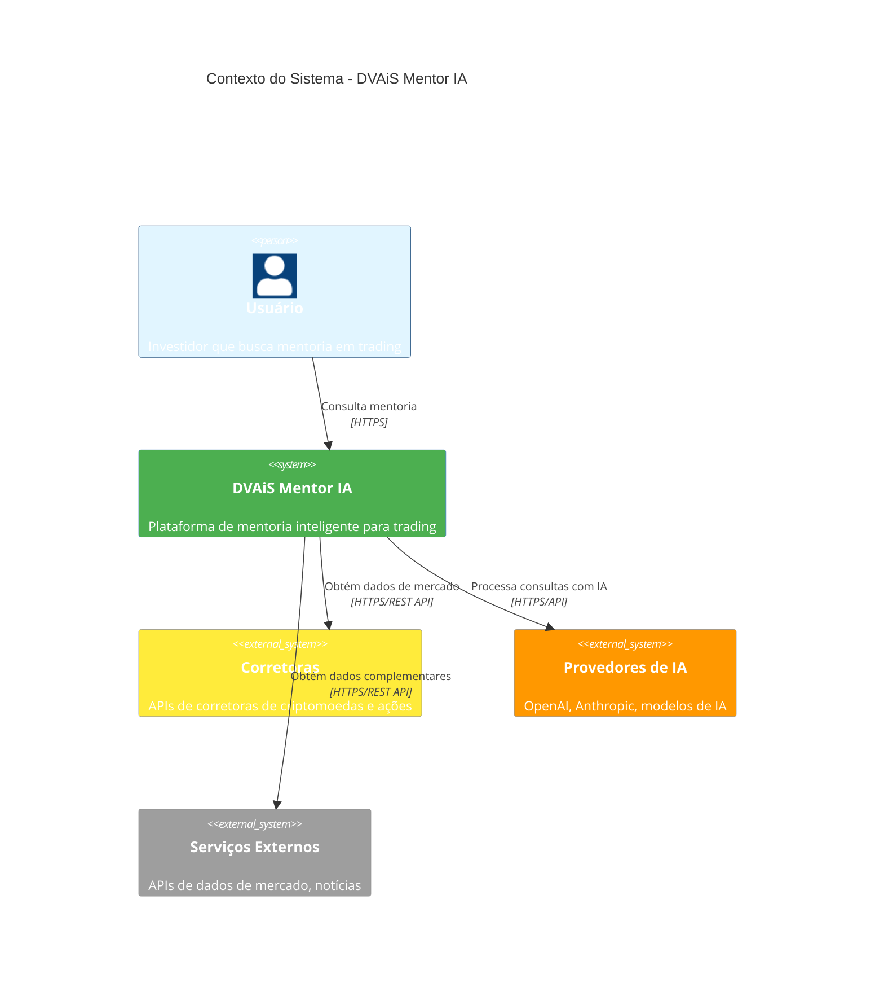

# Arquitetura Completa do DVAiS Mentor IA

## 1. Visão Geral - Analogia do Corpo Humano

O DVAiS Mentor IA utiliza uma arquitetura hierárquica inspirada na organização do corpo humano, facilitando a compreensão e manutenção do sistema.

### Estrutura Hierárquica

```
┌─────────────────────────────────────────────────────────┐
│ CORPO (Sistema Completo)                                │
│ - DVAiS Mentor IA                                       │
│ - Organização geral e coordenação                       │
└─────────────────────────────────────────────────────────┘
                    │
        ┌───────────┴───────────┐
        │                       │
┌───────▼────────┐    ┌─────────▼────────┐
│ ÓRGÃOS         │    │ ÓRGÃOS           │
│ (Apps/Services)│    │ (Apps/Services)   │
│                │    │                  │
│ - Painel Web   │    │ - API Backend    │
│ - Memória      │    │ - Dados Mercado  │
│ - Observabilidade│  │ - Serviços Ext.  │
└────────────────┘    └──────────────────┘
        │                       │
        └───────────┬───────────┘
                    │
        ┌───────────▼───────────┐
        │ CÉLULAS               │
        │ (Componentes)         │
        │                       │
        │ - Páginas            │
        │ - Componentes UI     │
        │ - Serviços            │
        │ - Hooks               │
        └───────────────────────┘
                    │
        ┌───────────▼───────────┐
        │ ÁTOMOS                │
        │ (Utilitários)         │
        │                       │
        │ - Funções helpers     │
        │ - Tipos TypeScript    │
        │ - Constantes          │
        │ - Validações          │
        └───────────────────────┘
```

### Descrição dos Níveis

- **CORPO**: O sistema completo DVAiS Mentor IA, coordenando todas as partes
- **ÓRGÃOS**: Aplicações e serviços principais (`apps/`, `services/`)
- **CÉLULAS**: Componentes funcionais específicos (páginas, componentes React, serviços)
- **ÁTOMOS**: Elementos básicos reutilizáveis (utilitários, tipos, validações)

---

## 2. C4 - Contexto (Context)

O diagrama de contexto mostra o sistema DVAiS Mentor IA e suas interações com usuários e sistemas externos.



### Descrição do Contexto

- **Usuário**: Investidor que interage com a plataforma para obter mentoria
- **DVAiS Mentor IA**: Sistema principal que coordena todas as funcionalidades
- **Corretoras**: Fontes de dados de mercado (preços, histórico, ordens)
- **Provedores de IA**: Serviços de processamento de linguagem natural e análise
- **Serviços Externos**: APIs complementares (notícias, análises, dados históricos)

---

## 3. C4 - Containers (Containers)

O diagrama de containers mostra os principais subsistemas do DVAiS Mentor IA.

```mermaid
C4Container
    title Containers do Sistema - DVAiS Mentor IA
    
    Person(usuario, "Usuário", "Investidor")
    
    System_Boundary(dvais, "DVAiS Mentor IA") {
        Container(painel_web, "Painel Web", "Next.js 14, React, TypeScript", "Interface do usuário")
        Container(api, "API Backend", "Node.js, Express/Fastify", "API REST/GraphQL") {
            Note(api_note, "🔮 FUTURO")
        }
        Container(memoria, "Sistema de Memória", "Banco de dados, Vector DB", "Armazena contexto e histórico") {
            Note(memoria_note, "🔮 FUTURO")
        }
        Container(dados_mercado, "Dados de Mercado", "Cache, ETL", "Agrega dados de corretoras") {
            Note(dados_note, "🔮 FUTURO")
        }
        Container(observabilidade, "Observabilidade", "Logs, Métricas, Tracing", "Monitoramento do sistema") {
            Note(obs_note, "🔮 FUTURO")
        }
    }
    
    System_Ext(corretoras, "Corretoras", "APIs de corretoras")
    System_Ext(ia_providers, "Provedores de IA", "OpenAI, Anthropic")
    System_Ext(servicos_ext, "Serviços Externos", "APIs complementares")
    
    Rel(usuario, painel_web, "Usa", "HTTPS")
    Rel(painel_web, api, "Chama", "HTTPS/REST") {
        Note(painel_api_note, "🔮 FUTURO")
    }
    Rel(api, memoria, "Lê/Escreve", "SQL/NoSQL") {
        Note(api_mem_note, "🔮 FUTURO")
    }
    Rel(api, dados_mercado, "Consulta", "Internal API") {
        Note(api_dados_note, "🔮 FUTURO")
    }
    Rel(api, corretoras, "Obtém dados", "HTTPS/REST API") {
        Note(api_corr_note, "🔮 FUTURO")
    }
    Rel(api, ia_providers, "Processa com IA", "HTTPS/API") {
        Note(api_ia_note, "🔮 FUTURO")
    }
    Rel(api, servicos_ext, "Obtém dados", "HTTPS/REST API") {
        Note(api_ext_note, "🔮 FUTURO")
    }
    Rel(observabilidade, api, "Monitora", "Internal") {
        Note(obs_api_note, "🔮 FUTURO")
    }
    Rel(observabilidade, painel_web, "Monitora", "Internal") {
        Note(obs_painel_note, "🔮 FUTURO")
    }
    
    UpdateElementStyle(usuario, $bgColor="#e1f5ff")
    UpdateElementStyle(painel_web, $bgColor="#4CAF50", $fontColor="#fff")
    UpdateElementStyle(api, $bgColor="#ff9800", $fontColor="#fff")
    UpdateElementStyle(memoria, $bgColor="#9e9e9e")
    UpdateElementStyle(dados_mercado, $bgColor="#9e9e9e")
    UpdateElementStyle(observabilidade, $bgColor="#9e9e9e")
    UpdateElementStyle(corretoras, $bgColor="#ffeb3b")
    UpdateElementStyle(ia_providers, $bgColor="#ff9800")
    UpdateElementStyle(servicos_ext, $bgColor="#9e9e9e")
```

### Descrição dos Containers

#### ✅ Painel Web (EXISTE)
- **Tecnologia**: Next.js 14, React, TypeScript
- **Responsabilidade**: Interface do usuário, autenticação frontend, visualizações
- **Status**: Implementado e funcional

#### 🔮 API Backend (FUTURO)
- **Tecnologia**: Node.js, Express/Fastify
- **Responsabilidade**: Processamento de consultas, integração com IA, lógica de negócio
- **Status**: Planejado para Fase 1 (MVP)

#### 🔮 Sistema de Memória (FUTURO)
- **Tecnologia**: Banco de dados relacional/NoSQL, Vector DB
- **Responsabilidade**: Armazenar contexto do usuário, histórico de conversas, memória persistente
- **Status**: Planejado para Fase 2

#### 🔮 Dados de Mercado (FUTURO)
- **Tecnologia**: Cache (Redis), ETL
- **Responsabilidade**: Agregar e cachear dados de múltiplas corretoras
- **Status**: Planejado para Fase 1 (MVP)

#### 🔮 Observabilidade (FUTURO)
- **Tecnologia**: Logs estruturados, métricas, tracing
- **Responsabilidade**: Monitoramento, alertas, análise de performance
- **Status**: Planejado para Fase 1 (MVP)

---

## 4. C4 - Componentes do Painel Web (Components)

O diagrama de componentes mostra a estrutura interna do Painel Web.

```mermaid
C4Component
    title Componentes do Painel Web - DVAiS Mentor IA
    
    Person(usuario, "Usuário", "Investidor")
    
    Container_Boundary(painel_web, "Painel Web (Next.js 14)") {
        Component(paginas, "Páginas", "Next.js App Router", "Rotas e páginas principais")
        Component(componentes_ui, "Componentes UI", "React Components", "Componentes reutilizáveis")
        Component(auth_frontend, "Autenticação Frontend", "React Hooks, Zod", "Validação e formulários")
        Component(processamento_ia, "Processamento IA", "TensorFlow.js", "IA no cliente")
        Component(analise_tempo_real, "Análise Tempo Real", "React Components", "Dashboard e visualizações")
        Component(estilos, "Sistema de Estilos", "Tailwind CSS", "Design system")
    }
    
    System_Ext(api_futura, "API Backend", "🔮 FUTURO")
    System_Ext(ia_providers, "Provedores de IA", "🔮 FUTURO")
    
    Rel(usuario, paginas, "Navega", "HTTPS")
    Rel(paginas, componentes_ui, "Renderiza", "Internal")
    Rel(paginas, auth_frontend, "Usa", "Internal")
    Rel(paginas, analise_tempo_real, "Exibe", "Internal")
    Rel(componentes_ui, estilos, "Aplica", "Internal")
    Rel(processamento_ia, ia_providers, "Chama", "HTTPS/API") {
        Note(ia_note, "🔮 FUTURO")
    }
    Rel(auth_frontend, api_futura, "Autentica", "HTTPS/REST") {
        Note(auth_note, "🔮 FUTURO")
    }
    Rel(analise_tempo_real, api_futura, "Obtém dados", "HTTPS/REST") {
        Note(dados_note, "🔮 FUTURO")
    }
    
    UpdateElementStyle(usuario, $bgColor="#e1f5ff")
    UpdateElementStyle(paginas, $bgColor="#4CAF50", $fontColor="#fff")
    UpdateElementStyle(componentes_ui, $bgColor="#4CAF50", $fontColor="#fff")
    UpdateElementStyle(auth_frontend, $bgColor="#4CAF50", $fontColor="#fff")
    UpdateElementStyle(processamento_ia, $bgColor="#4CAF50", $fontColor="#fff")
    UpdateElementStyle(analise_tempo_real, $bgColor="#4CAF50", $fontColor="#fff")
    UpdateElementStyle(estilos, $bgColor="#4CAF50", $fontColor="#fff")
    UpdateElementStyle(api_futura, $bgColor="#9e9e9e")
    UpdateElementStyle(ia_providers, $bgColor="#9e9e9e")
```

### Componentes Existentes

#### Páginas (`app/`)
- ✅ `page.tsx` - Página inicial
- ✅ `login/page.tsx` - Página de login
- ✅ `cadastro/page.tsx` - Página de cadastro
- ✅ `analise-tempo-real/page.tsx` - Dashboard de análise

#### Componentes UI (`componentes/`)
- ✅ `Header.tsx` - Cabeçalho da aplicação
- ✅ `Footer.tsx` - Rodapé
- ✅ `Hero.tsx` - Seção hero da página inicial
- ✅ `Features.tsx` - Seção de features
- ✅ `Stats.tsx` - Estatísticas
- ✅ `Comets.tsx` - Efeitos visuais
- ✅ `AnimatedEye.tsx` - Animações
- ✅ `FixedLogo.tsx` - Logo fixo

#### Componentes de Análise (`componentes/AnaliseTempoReal/`)
- ✅ `Hero.tsx` - Hero da página de análise
- ✅ `DadosCorretoras.tsx` - Dados de corretoras
- ✅ `DadosExclusivos.tsx` - Dados exclusivos
- ✅ `VantagemCompetitiva.tsx` - Vantagens competitivas
- ✅ `PublicoAlvo.tsx` - Público-alvo
- ✅ `MoedaGirando.tsx` - Visualização de moeda

#### Autenticação Frontend (`componentes/auth/`)
- ✅ `LoginForm.tsx` - Formulário de login
- ✅ `RegisterForm.tsx` - Formulário de cadastro
- ✅ `OAuthButtons.tsx` - Botões OAuth
- ✅ `PasswordStrength.tsx` - Validação de senha
- ✅ `PhoneInput.tsx` - Input de telefone

#### Processamento IA (`biblioteca/ai/`)
- ✅ `config.ts` - Configuração de IA
- ✅ `models.ts` - Modelos de IA
- ✅ `useAI.ts` - Hook para uso de IA

#### Validação (`biblioteca/auth/`)
- ✅ `validation.ts` - Validações de autenticação

#### Tipos (`tipos/`)
- ✅ `auth.ts` - Tipos de autenticação

---

## 5. Checklist: JÁ EXISTE vs FALTA FAZER

### ✅ MVP - Fase 1 (JÁ EXISTE)

#### Frontend
- [x] Estrutura Next.js 14 com App Router
- [x] Páginas: Home, Login, Cadastro, Análise Tempo Real
- [x] Componentes UI reutilizáveis
- [x] Sistema de autenticação frontend (validação)
- [x] Componentes de análise e visualização
- [x] Sistema de estilos (Tailwind CSS)
- [x] Configuração de IA no cliente (TensorFlow.js)
- [x] PWA (Progressive Web App)
- [x] WebAssembly para performance

#### Infraestrutura
- [x] Estrutura de monorepo (`apps/`, `services/`, `packages/`)
- [x] Documentação de arquitetura
- [x] `.gitignore` configurado
- [x] Configurações do VS Code/Cursor

### 🔮 MVP - Fase 1 (FALTA FAZER)

#### Backend
- [ ] API REST/GraphQL (Node.js)
- [ ] Autenticação backend (JWT, OAuth)
- [ ] Integração com provedores de IA (OpenAI, Anthropic)
- [ ] Integração com APIs de corretoras
- [ ] Sistema de cache de dados de mercado
- [ ] Logs estruturados (`storage/logs/log_ops.jsonl`)

#### Frontend
- [ ] Integração com API backend
- [ ] Autenticação real (não apenas validação frontend)
- [ ] Carregamento de dados reais de corretoras
- [ ] Processamento de consultas via IA backend

### 🔮 Fase 2 - Recursos Avançados (FUTURO)

#### Memória e Contexto
- [ ] Sistema de memória persistente
- [ ] Vector database para contexto
- [ ] Histórico de conversas
- [ ] Personalização por usuário

#### Interface Avançada
- [ ] Interface de voz (speech-to-text, text-to-speech)
- [ ] Visualizações 3D interativas
- [ ] Gráficos avançados e interativos
- [ ] Animações 3D de personagens

#### Análise Avançada
- [ ] Análise preditiva avançada
- [ ] Machine Learning customizado
- [ ] Integração com múltiplas fontes de dados
- [ ] Recomendações personalizadas avançadas

#### Observabilidade
- [ ] Sistema de métricas completo
- [ ] Tracing distribuído
- [ ] Alertas automáticos
- [ ] Dashboard de monitoramento

---

## 6. Convenções de Nomes e Pastas

### Regras Gerais

1. **Paths sem acentos**: Todos os caminhos de arquivos e pastas devem usar caracteres ASCII
   - ✅ `autenticacao` (não `autenticação`)
   - ✅ `analise` (não `análise`)
   - ✅ `memoria` (não `memória`)

2. **kebab-case para pastas**: Todas as pastas devem usar kebab-case
   - ✅ `painel-web`
   - ✅ `analise-tempo-real`
   - ✅ `dados-mercado`
   - ❌ `PainelWeb` (PascalCase)
   - ❌ `analise_tempo_real` (snake_case)

3. **Documentação pode ter acentos**: Arquivos `.md` podem ter acentos no conteúdo, mas não no nome do arquivo
   - ✅ `docs/ARQUITETURA_COMPLETA.md` (nome sem acento)
   - ✅ Conteúdo: "Arquitetura Completa" (pode ter acento)

### Estrutura de Pastas

```
apps/
  painel-web/          ✅ kebab-case, sem acentos
    app/
      analise-tempo-real/  ✅ kebab-case
      cadastro/            ✅ sem acentos
      login/               ✅ sem acentos
    componentes/
      auth/                ✅ sem acentos
      AnaliseTempoReal/    ✅ PascalCase (componentes React)
    biblioteca/
      ai/                  ✅ sem acentos
      auth/                ✅ sem acentos

services/              ✅ kebab-case (futuro)
  api-backend/         ✅ kebab-case
  memoria/             ✅ sem acentos
  dados-mercado/       ✅ kebab-case

docs/                  ✅ sem acentos
  adr/                 ✅ sem acentos
  ARQUITETURA_COMPLETA.md  ✅ UPPER_SNAKE_CASE para docs principais
```

### Convenções de Arquivos

- **Componentes React**: PascalCase (`Header.tsx`, `LoginForm.tsx`)
- **Páginas Next.js**: `page.tsx`, `layout.tsx` (lowercase)
- **Utilitários**: camelCase (`validation.ts`, `config.ts`)
- **Tipos**: camelCase (`auth.ts`, `user.ts`)
- **Documentação**: UPPER_SNAKE_CASE ou kebab-case (`ARQUITETURA_COMPLETA.md`, `como-rodar.md`)

---

## 7. Regras de Performance

### ❌ PROIBIDO

1. **Nunca usar `memo()` em componentes**
   - Causa erros `<nextjs-portal>` recorrentes
   - Next.js já otimiza automaticamente

2. **Nunca usar `` em vez de `next/image`**
   - Perde otimizações automáticas de imagem
   - Aumenta bundle size desnecessariamente

3. **Nunca importar componentes pesados diretamente**
   - Use `dynamic()` para lazy loading
   - Componentes 3D, players de vídeo, módulos de IA

4. **Nunca usar `'use client'` desnecessariamente**
   - Server Components por padrão
   - Reduz JavaScript inicial em ~40%

5. **Nunca animar propriedades que causam reflow**
   - ❌ `width`, `height`, `top`, `left`, `margin`, `padding`
   - ✅ Use `transform` e `opacity` (GPU accelerated)

6. **Nunca usar `preload="auto"` em vídeos**
   - Carrega vídeo inteiro desnecessariamente
   - Use `preload="metadata"`

7. **Nunca fazer build outputs entrarem no Git**
   - `.next/`, `node_modules/`, `out/`, `.vercel/`
   - Devem estar no `.gitignore`

### ✅ RECOMENDADO

1. **Sempre usar Server Components por padrão**
   - Reduz JavaScript inicial
   - Melhor performance e SEO

2. **Sempre usar `next/image` para imagens**
   - Otimização automática
   - Lazy loading nativo
   - Formatos modernos (WebP, AVIF)

3. **Sempre usar `next/font` para fontes**
   - Otimização automática
   - Self-hosting
   - Melhor performance

4. **Sempre usar lazy loading para componentes pesados**
   ```typescript
   const HeavyComponent = dynamic(() => import('@/componentes/Heavy'), {
     loading: () => <div className="min-h-[400px]" />,
     ssr: false, // Apenas se não precisar de SSR
   })
   ```

5. **Sempre usar `transform` e `opacity` para animações**
   - GPU accelerated
   - 60 FPS garantido
   - Não causa reflow

6. **Sempre medir performance**
   - FCP < 1.8s
   - LCP < 2.5s
   - TTI < 3s
   - Bundle size < 500KB (gzipped)

7. **Sempre usar WebAssembly para processamento pesado**
   - TensorFlow.js com backend WASM
   - 10-100x mais rápido que JavaScript puro

8. **Sempre usar code splitting**
   - Next.js faz automaticamente
   - Chunks separados para vendors e código próprio

---

## 8. Notas Importantes

### Marcação de Funcionalidades Futuras

Este documento marca claramente o que é **FUTURO** usando o símbolo 🔮 e notas explicativas. Todos os containers e componentes futuros estão claramente identificados.

### Evolução da Arquitetura

A arquitetura está preparada para crescer:
- ✅ Frontend funcional e completo
- 🔮 Backend planejado e documentado
- 🔮 Serviços futuros com estrutura definida
- 🔮 Integrações externas mapeadas

### Manutenção

Este documento deve ser atualizado sempre que:
- Novos componentes forem criados
- Novas integrações forem implementadas
- Mudanças arquiteturais significativas ocorrerem

---

**Última atualização**: 2025-01-27  
**Versão**: 1.0
