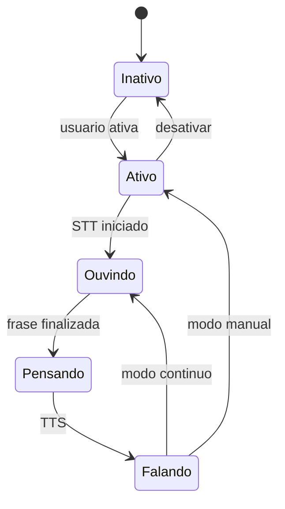

# Assistente Live (voz + selecao)

## Objetivo
Apresentar a plataforma como um vendedor ao vivo: o usuario seleciona um item da pagina e faz perguntas por voz. O assistente responde de forma curta e profissional e guia o usuario com destaque visual.

## Como funciona
1. **Ativacao**: usuario concede permissao de microfone.
2. **Selecao**: duplo clique rapido seleciona o assunto. Clique unico mantem o comportamento normal (abrir paginas).
3. **Pergunta por voz**: o assistente capta a fala, envia a pergunta e responde em tempo real.
4. **Acoes visuais**: scroll, highlight ou navegacao guiada.
5. **Widget global**: nas paginas publicas (login, cadastro e paginas de conteudo), um botao flutuante abre o assistente ao vivo.

## Regras de UX
- Modo texto fica oculto por padrao (debug apenas).
- Se o usuario disser "entendi", "outro assunto" ou similar, a selecao e limpa.
- A selecao expira automaticamente apos 2 minutos sem uso.
- O assistente sempre pergunta se o usuario quer saber mais sobre o assunto selecionado.

## Estados principais

## Contexto do clique
Quando o usuario faz duplo clique, o sistema envia:
- `clickedTargetId` (se o elemento tem ID mapeado)
- `clickedText` (texto visivel do elemento)
- `clickedTag` (tag HTML)

Esse contexto ajuda a IA a responder sobre o item selecionado, mesmo que a pergunta seja generica.

## Debug
- Ativar modo texto: `NEXT_PUBLIC_ASSISTENTE_TEXT_DEBUG=true`.
- Mesmo em debug, o fluxo de voz continua disponivel.
